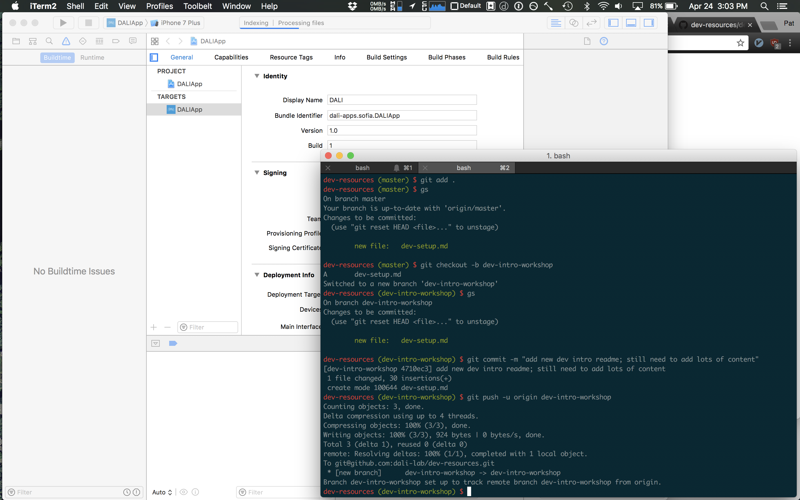
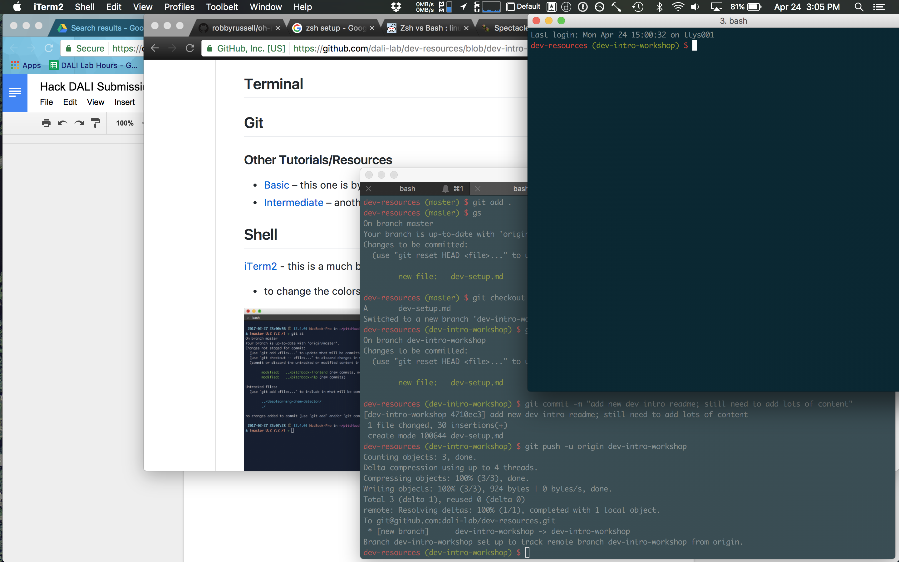
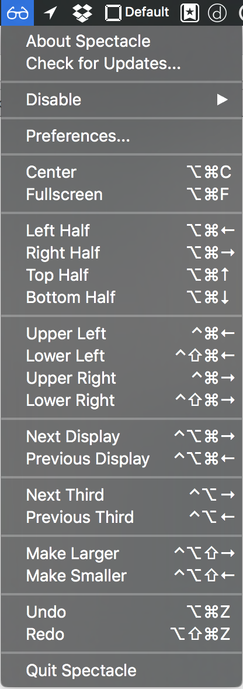
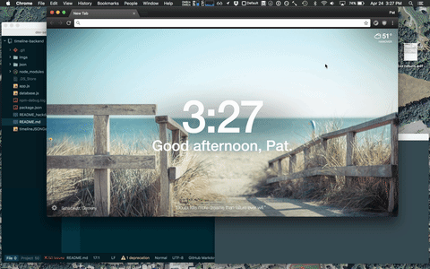

# DALI Dev Tools

A resource for devs looking to learn dev essentials like: making full use of your terminal, setting up your text editor with all the right addons, and mastering git/Github.

## Topics

- [Terminal](#terminal)
- [Git](#git)
- [Shell](#shell)
- [Window Management](#window-management)

## Terminal

## Git

### Other Resources
- [using Keychain to store your Github credentials](https://help.github.com/articles/caching-your-github-password-in-git/) – clone with HTTPS and save your credentials using MacOS Keychain
- [Basic](https://try.github.io/) – this one is by Github and is basic and beginner-friendly
- [Intermediate](http://rogerdudler.github.io/git-guide/) – another which is less interactive but is still easy to follow and talks about some good commands

## Shell

[iTerm2](http://iterm2.com) - this is a much better Terminal command line than the default Terminal.app that comes on your Mac
  - to change the colors: preferences > profile > colors
  

## Window Management
Window management involves efficiently organizing the windows you have open on your screen. There are two parts to this: making the window the proper size, and sizing it quickly.

### Why is this Important?

Does this look familiar?

It's incredibly inefficient to work in an environment when you constantly have to go to click through various windows or to use windows that are smaller than they could be (e.g. Xcode, which has a lot of UI elements, should pretty much always be fullscreen).

We're going to use a window management tool **Spectacle** and **⌘-tab** to streamline your workflow.

### [Spectacle](https://www.spectacleapp.com/)
Spectacle is a desktop app that makes window movement and resizing easy. It hides in your top toolbar and has pretty sure everything you'd ask for. This is the easiest window management tool to set up and start using.

Here's a demo of me using it only a couple minutes after downloading it (I use a different resizing tool, which I link below).

In a few seconds, I've full screened Chrome, moved my iTerm windows to the upper left and upper right corners of the screen, and moved Atom to the left half of the screen.

### ⌘-Tab
Command-tab (alt-tab on Windows) let's you use your keyboard to switch windows/applications.

1. Hold down ⌘
1. Tap tab
1. You'll see a horizontal list of all open applications, ordered by most recently used
1. Release tab to select the application, **or**
1. Press tab again to select the next application

I demo this in the above gif.

### Other Resources
- [Hammerspoon](http://www.hammerspoon.org/) is a MacOS automation framework and involves writing scripts in Lua to customize your workflow. You can use [my configuration](https://github.com/patxu/dotfiles/tree/master/hammerspoon) to see how I do window management. Send feedback and questions my way!
